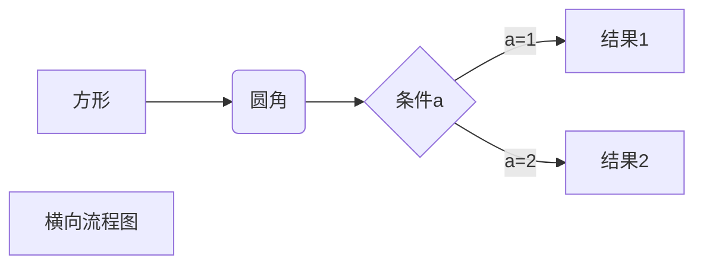
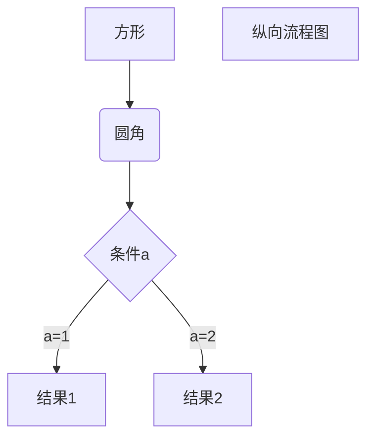
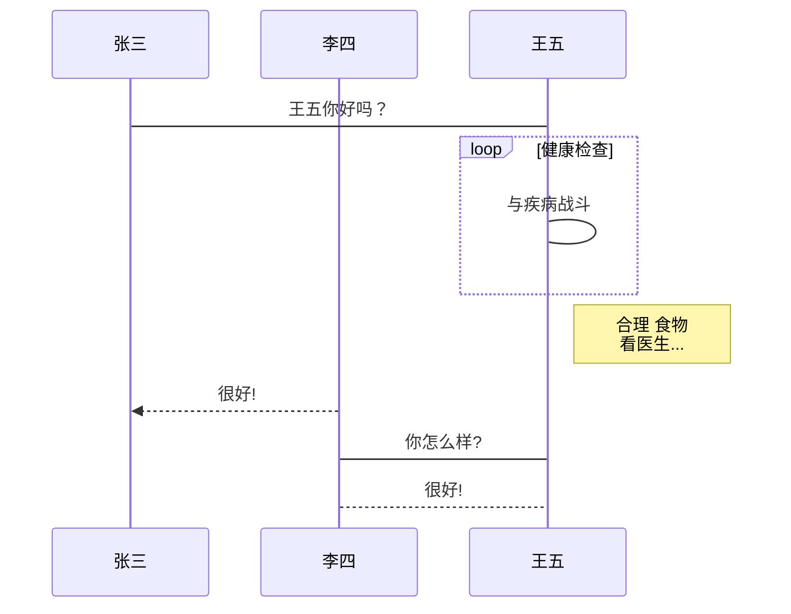
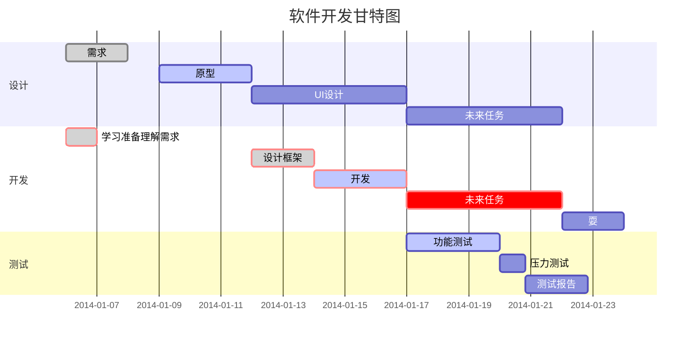

# 一.块级元素:

# 这是一级标题

这是一级标题
===

## 这是二级标题

这是二级标题
---

### 这是三级标题
分段落的方法就是加一行空行
> 这是个块引用内容并且强制换行(在每一行尾输入两个空格即可)
> 这是个块引用内容  
> 这是个块引用内容  
> 这是个块引用内容  

> 块引用嵌套效果
> > 啦啦啦

### 无序列表的表现形式如下：
#### 第一种：
* red
* yellow 
* blue
#### 第二种：
+ red
+ yellow 
+ blue
#### 第三种：
- red
- yellow 
- blue

如果有代码块，怎么办呢,那就缩进一个tab或4个空格

    神奇的代码块代码块 

### 有序列表的表现形式如下：
1. bird
1. wangwang 
10000. miaomiao


1. This is a list item with two paragraphs. Lorem ipsum dolor
   sit amet, consectetuer adipiscing elit. Aliquam hendrerit
    mi posuere lectus.

    列表项中如果有多个段落，那么每个段落的开头都必须缩进,如当前段啦啦啦啦啦啦啦
啦啦啦啦啦啦啦啦啦啦啦啦啦啦啦啦啦啦啦啦啦

1. This is a list item with two paragraphs. Lorem ipsum dolor
   sit amet, consectetuer adipiscing elit. Aliquam hendrerit
    mi posuere lectus.

 这就是不缩进的后果，怕了没怕了没哼哼哼哼啦啦啦啦啦啦啦
    啦啦啦啦啦啦啦

1000. 又是一段,可惜因为前面这个猪队友不缩进，所以不生效了(好像不是不生效，而是直接跳到当前顺序了)
1000. 又是一段,可惜因为前面这个猪队友不缩进，所以不生效了


1. hello

30\. 这样当个斜杠青年就不会继续标随波逐流随便被别人标记啦啦啦啦啦啦

    这是代码块喔 注意 markdown的语法在代码块中是无效的
        这是小代码块喔
    这还是代码块喔
 这不是是代码块了,因为没缩进了

 第一种线：
  * * *
 第二种线：

 ---

 第三种线：
  ___

第四种线：
 <hr />

# 二.内联元素:
1.  链接：This is [an example](http://example.com/ "Title") inline lin.
 [This link](http://example.net/) has no title attribute.

4.  See my [About](/about/) page for details.

定义标签链接:

[id]: http://www.baidu.com/  "鼠标移上来就看到我啦！"

点击它你就明白一切了 骚年 [id]

以下三个等价：

[foo]: http://example.com/  "Optional Title Here"

[foo]: http://example.com/  'Optional Title Here'

[foo]: http://example.com/  (Optional Title Here)


强调语法：

*这是倾斜*

**这是加粗**

_这也是倾斜_

__这也是加粗__

*

\*

代码(不是代码块哦);
这是上文 `这是代码` 这是下文

<code>这也是代码 function(){console.log('hello world')}</code>

 使用字面量的重音符号: `` `foo` ``

Please don't use any `<blink>` tags.

### 表格

1. #### 极简方式

name | 价格 | 数量 
-|-|-
香蕉 | $1 | 5 
苹果 | $1 | 5 
菠萝 | $1 | 5 

1. #### 简单方式(居中与不居中的写法对比)

name | 11111 | 22222 | 33333 | 44444
:-: | :-: | -: | :- | -
a | b | c| d | e |

脚注:

这样创建[^脚注]

[^脚注]: 快来学习markdown吧！

注意：脚注在vscode表现有点怪，但是在Typola上显示是正常的：


快捷键表现方式

使用 <kbd>ctrl</kbd>+<kbd>alt</kbd>+<kbd>e</kbd> 就可以上传markdown图片到github啦

插入图片方法一(内联)：


插入图片方法二(引用)：

[img]: ./tmpImageForGitHub/demo3.png  "鼠标移上来的提示,这个提示是可选项哦"

![图片加载失败时的提示][img]

插入图片方法三(目前写博文推荐方法,通过picGo插件，将图片上传github图片仓库,快捷键ctrl+alt+e选择图片即可,可批量哦)

 


插入图片方法四(base64引用)。发博文推荐此方法,不过由于base64很长串，导致整个文件超过vscode规定的editor.maxTokenizationLineLength=20000字符的要求，所以编辑器会卡死，目前暂未找到解决办法,所以现在暂且不用该方法

![图片加载失败时的提示][img1]

[img1]:data:balabala...


## markdown还可以画流程图:

* 横向流程图


在vscode没有预览效果，但在Typora就有了：


* 纵向流程图



* 纵向标准流程图
```flow
st=>start: 开始框
op=>operation: 处理框
cond=>condition: 判断框(是或否?)
sub1=>subroutine: 子流程
io=>inputoutput: 输入输出框
e=>end: 结束框
st->op->cond
cond(yes)->io->e
cond(no)->sub1(right)->op
```

* 横向标准流程图
```flow
st=>start: 开始框
op=>operation: 处理框
cond=>condition: 判断框(是或否?)
sub1=>subroutine: 子流程
io=>inputoutput: 输入输出框
e=>end: 结束框
st(right)->op(right)->cond
cond(yes)->io(bottom)->e
cond(no)->sub1(right)->op
```
* UML时序图

```sequence
对象A->对象B: 对象B你好吗?（请求）
Note right of 对象B: 对象B的描述
Note left of 对象A: 对象A的描述(提示)
对象B-->对象A: 我很好(响应)
对象A->对象B: 你真的好吗？
```

* 复杂UML时序图
```sequence
Title: 标题：复杂使用
对象A->对象B: 对象B你好吗?（请求）
Note right of 对象B: 对象B的描述
Note left of 对象A: 对象A的描述(提示)
对象B-->对象A: 我很好(响应)
对象B->小三: 你好吗
小三-->>对象A: 对象B找我了
对象A->对象B: 你真的好吗？
Note over 小三,对象B: 我们是朋友
participant C
Note right of C: 没人陪我玩
```
* UML标准时序图


* 甘特图

